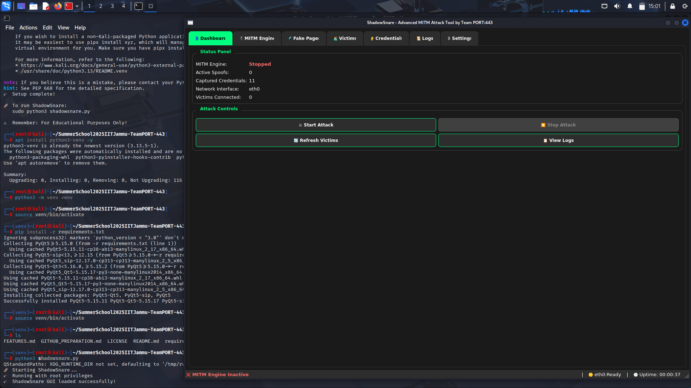
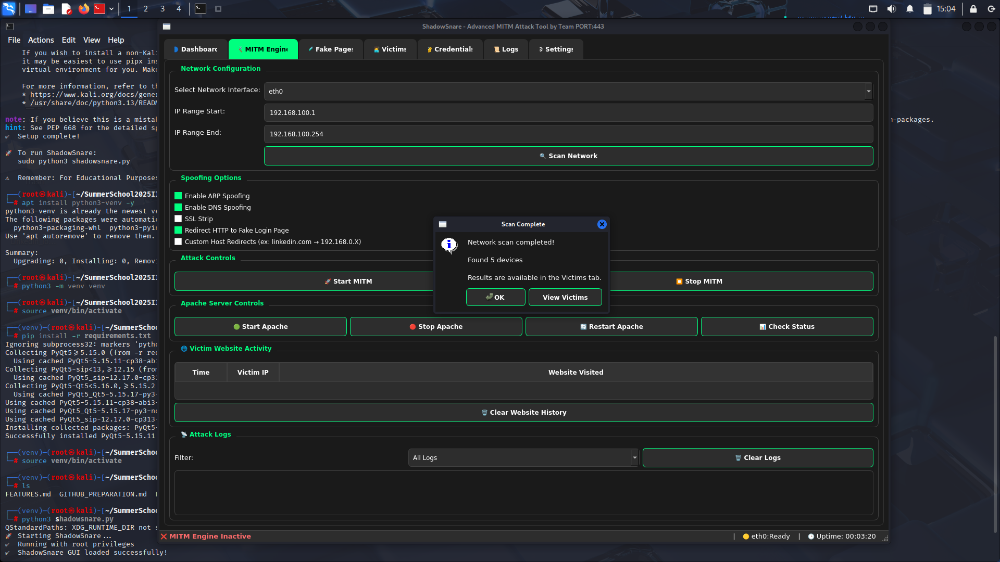
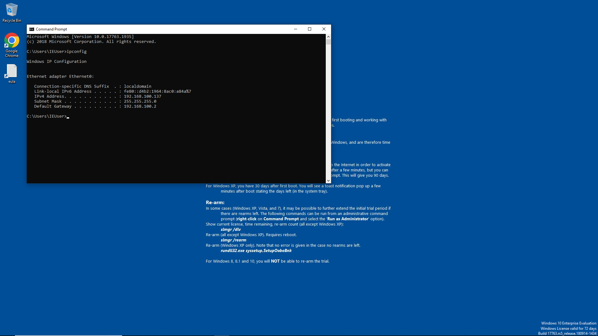
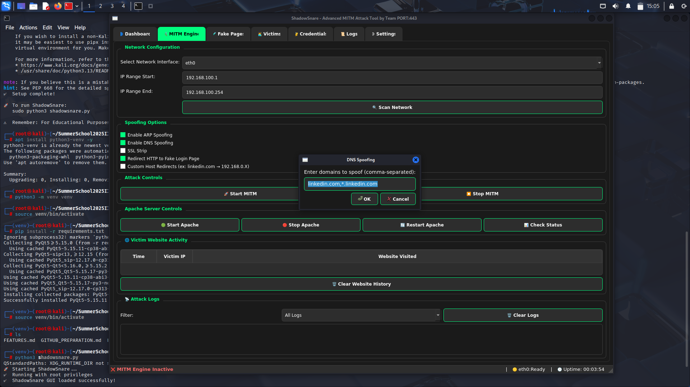
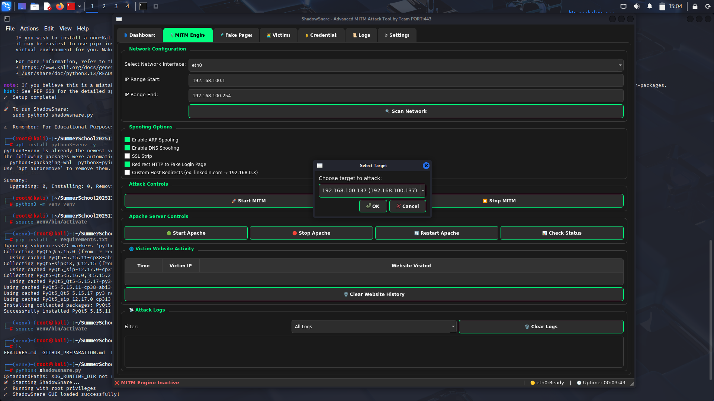
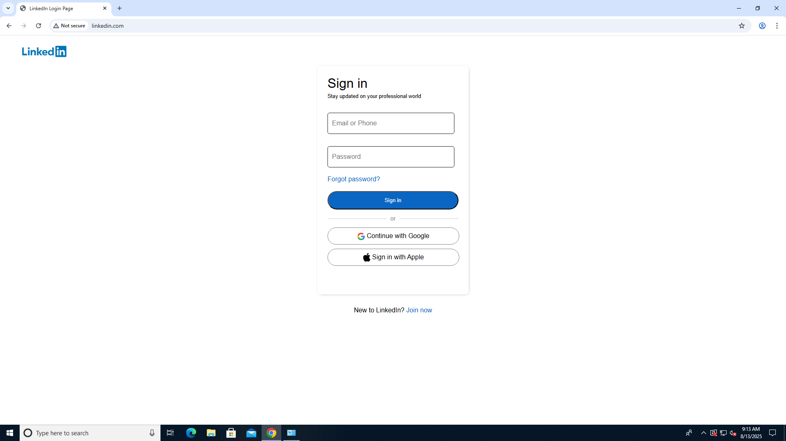
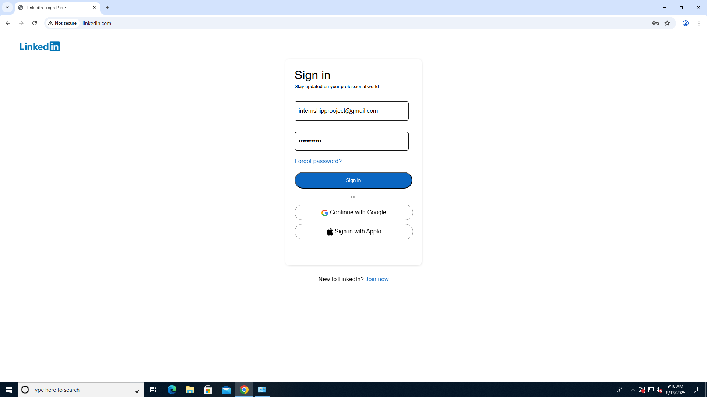
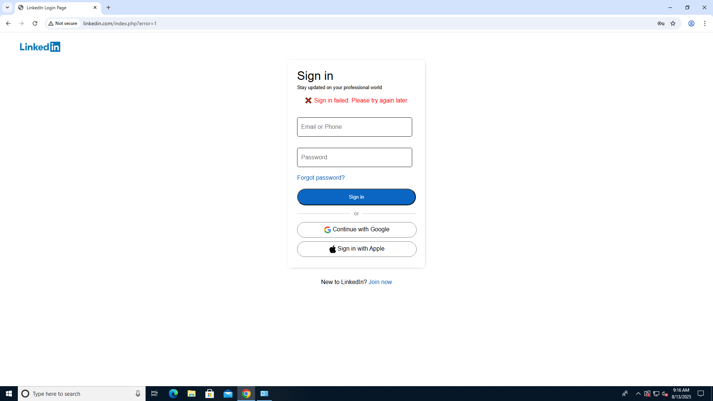
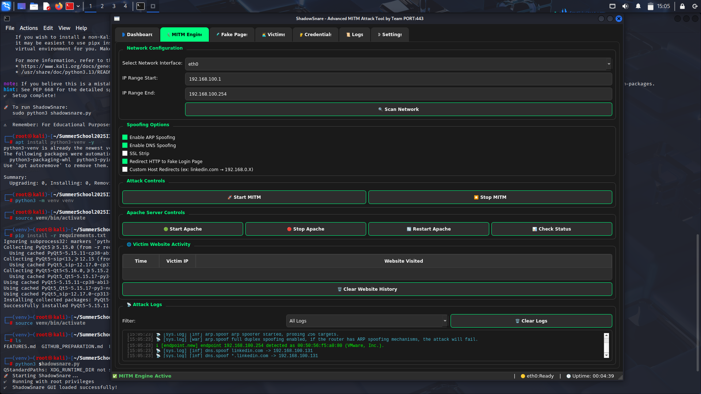

# ShadowSnare

> Advanced MITM GUI Tool for Educational Cybersecurity Research

<div align="center">

[](https://hackatime.hackclub.com/)

**Total coding time tracked using Hackatime**


</div>

## Overview

ShadowSnare is a comprehensive GUI-based Man-in-the-Middle attack tool developed for cybersecurity education during Summer School 2025 at IIT Jammu. It provides a complete framework for understanding network vulnerabilities through an intuitive PyQt5 interface.

### Key Capabilities
- Real-time network reconnaissance and target discovery
- Advanced ARP and DNS spoofing techniques
- Traffic interception and analysis
- Phishing infrastructure deployment
- Comprehensive logging and monitoring

```
Target → ShadowSnare → Internet
         ↓
    Attack Dashboard
```

> **See the complete attack demonstration in the [Screenshots & Demo](#screenshots--demo) section below.**

## Features

### Core Attack Modules
- **Network Scanner** - Automated target discovery using nmap integration
- **ARP Spoofing** - Traffic redirection through ARP table manipulation  
- **DNS Spoofing** - Domain hijacking with DoH/DoT blocking capabilities
- **GUI Interface** - Multi-tabbed PyQt5 dashboard with real-time updates
- **Phishing Framework** - Web server setup (users must create own pages in `/var/www/html/`)
- **Traffic Monitor** - Live packet analysis and credential capture
- **Session Management** - Multi-target attack coordination

> **Important:** ShadowSnare provides the framework but does NOT include pre-built phishing pages. Users must create their own educational test pages for demonstration purposes.

### Technical Features
- Bettercap integration for advanced network attacks
- Apache web server with SSL/TLS support via Cloudflare tunnels
- Real-time DNS verification and monitoring
- Comprehensive logging system
- Cross-platform compatibility (Linux focus)

## Installation

```bash
# Clone repository
git clone https://github.com/Saketkesar/SummerSchool2025IITJammu-TeamPORT-443.git
cd SummerSchool2025IITJammu-TeamPORT-443

# Setup dependencies
sudo ./setup.sh
pip3 install -r requirements.txt

# Launch application
sudo python3 shadowsnare.py
```

## Setting Up Educational Test Pages

ShadowSnare provides the attack framework but requires users to create their own educational test pages. This approach ensures ethical use and prevents misuse.

### Creating Test Pages

1. **Create your educational page:**
```bash
# Create a simple test page
sudo nano /var/www/html/index.html
```

2. **Example educational test page structure:**
```html
<!DOCTYPE html>
<html>
<head>
    <title>Educational Test Page</title>
</head>
<body>
    <h1>This is an Educational Test Page</h1>
    <p>Created for cybersecurity education purposes only</p>
    <!-- Add your educational form here -->
</body>
</html>
```

3. **Set proper permissions:**
```bash
sudo chown -R www-data:www-data /var/www/html/
sudo chmod -R 755 /var/www/html/
```

### Important Guidelines
- Only create pages for educational demonstration
- Use in controlled, isolated network environments
- Clearly label all content as educational/test material
- Never replicate real websites for malicious purposes

## How It Works

```
┌─────────────────┐    ┌─────────────────┐    ┌─────────────────┐
│     Victim      │────│   ShadowSnare   │────│   Real Server   │
│   192.168.1.16  │    │   192.168.1.14  │    │   target.com    │
└─────────────────┘    └─────────────────┘    └─────────────────┘
```

## Screenshots

### 1. ShadowSnare Homepage
The main interface provides an intuitive dashboard for all attack operations.



### 2. Network Scanning
Automated target discovery and network reconnaissance.



### 3. Target Selection
Identifying and selecting the target machine IP.



### 4. Domain Configuration
Setting up the domain to spoof for the attack.



### 5. Attack Execution
Launching the MITM attack against the target.



### 6. Phishing Page Deployment
The spoofed LinkedIn page presented to the victim.



> **⚠️ Educational Notice:** This LinkedIn page was created solely for educational purposes within our own controlled network environment. ShadowSnare does NOT provide pre-built phishing pages. Users must create their own test pages and place them in `/var/www/html/` for educational demonstration purposes only.

### 7. Credential Capture
Victim entering credentials on the spoofed page.



### 8. Post-Credential Entry
After the victim submits their credentials.



### 9. Attack Completion
Successful credential capture and attack completion with logs.



## Code Example

The following code demonstrates the core attack functionality shown in the screenshots above:

```python
# Start attack
def start_attack(target_ip, domain):
    commands = [
        f"set arp.spoof.targets {target_ip}",
        "arp.spoof on",
        f"set dns.spoof.domains {domain}",
        "dns.spoof on"
    ]
    execute_bettercap(commands)
```

## Team

**Team PORT:443**  
Dhruv Verma • Saket Kesar • Atharv Gaonker  
*Summer School 2025 - IIT Jammu*


## Contributing

We welcome contributions to improve ShadowSnare for educational purposes:

### How to Contribute
1. Fork the repository
2. Create a feature branch (`git checkout -b feature/improvement`)
3. Make your changes with proper documentation
4. Test thoroughly in isolated environments
5. Submit a pull request with detailed description

### Contribution Guidelines
- Follow ethical hacking principles
- Maintain educational focus
- Include proper error handling
- Add comprehensive comments
- Update documentation accordingly
- Test all network attack modules

### Areas for Contribution
- Additional attack vectors and modules
- GUI improvements and user experience
- Performance optimizations
- Cross-platform compatibility
- Documentation and tutorials
- Security enhancements


### Legal Compliance
Users must ensure compliance with local laws and regulations. The developers are not responsible for misuse of this educational tool.
